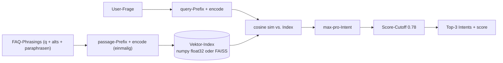

# Plan: Support-Intent-Klassifikator auf Multilingual-Embeddings umstellen

## Ausgangslage

| Metrik | TF-IDF + LR (aktuell) | Fuse-Baseline | Ziel |
|---|---|---|---|
| Top-1 (avg ueber 5 Locales) | **0.342** | 0.302 | >= 0.75 |
| Top-3 (avg) | **0.522** | 0.366 | >= 0.90 |
| #Klassen | 268 | 268 | 268 |
| Samples/Klasse/Lang | ~22 | ~22 | unveraendert |

TF-IDF stagniert bei ~35% Top-1 weil:
- 268 Klassen mit oft nur ~6 Original-Phrasings pro Sprache
- Char-/Word-N-Grams erfassen keine Semantik (`"Wie viel setze ich"` vs. `"Empfohlene Stake-Groesse"` haben null Token-Overlap)
- Kreuzlinguale Generalisierung unmoeglich (jede Sprache eigener Index)

Loesung: **Dichte multilinguale Embeddings** + Nearest-Neighbor-Retrieval mit kalibriertem Score-Cutoff.

---

## Modellwahl: intfloat/multilingual-e5

| Modell | Params | Dim | Disk (FP32) | RAM | CPU-Latenz | MTEB-Mittel |
|---|---|---|---|---|---|---|
| **e5-small** | 118 M | 384 | 470 MB | ~700 MB | ~5 ms/Satz | gut |
| **e5-base** | 278 M | 768 | 1.1 GB | ~1.5 GB | ~12 ms/Satz | besser |
| **e5-large** | 560 M | 1024 | 2.2 GB | ~3 GB | ~30 ms/Satz | sehr gut |
| **e5-large-instruct** | 560 M | 1024 | 2.2 GB | ~3 GB | ~30 ms/Satz | **best** |

Hardware-Budget Marcel (Ryzen 9 5900XT, 64 GB RAM, kein CUDA-GPU im Backend):
- Index-Groesse: 6.700 Vektoren x 1024 Dim x 4 B = **27 MB / Sprache** (gesamt 135 MB) - kein Problem
- One-Time-Embedding der Trainingsdaten: ~3 min auf 16 Cores fuer e5-large-instruct
- Inferenz: 30 ms / Anfrage ist ok fuer Support-Chat (User wartet ohnehin)

**Entscheidung: `intfloat/multilingual-e5-large-instruct`** als Primaer-Modell, `e5-base` als Fallback fuer Devices ohne genug RAM (z.B. CI).

API-Besonderheit: Instruction-Prefix beim Encoden:
```python
queries  = [f"query: {q}"   for q in user_inputs]
passages = [f"passage: {p}" for p in faq_phrasings]
```

---

## Architektur



- **Pro Intent** wird der Maximum-Score ueber alle seine Phrasings genommen (analog zur jetzigen Fuse-Baseline)
- **Cutoff 0.78** (Cosine, after L2-norm) - empirisch zu kalibrieren auf Val-Set, sodass Praezision bei >= 0.95 bleibt
- Unter Cutoff: Fallback-Antwort wie heute

---

## Datenpipeline (unveraendert)

`data/support_faq/dataset_augmented.jsonl` (31.715 Zeilen) liefert weiterhin:
- `id` (Intent), `lang`, `question`, `chapter`, `source`, `alt_questions[]`

Embedding-Index wird fuer **alle Zeilen** (Original + Paraphrase + Alt) berechnet, nicht nur Originale - so sind die Template-Paraphrasen auch im Retrieval nutzbar.

---

## Code-Aenderungen

### Neue Datei: `src/football_betting/support/embedding_model.py`
```python
from sentence_transformers import SentenceTransformer
import numpy as np

class EmbeddingIntentRetriever:
    def __init__(self, lang: str, model_name: str = "intfloat/multilingual-e5-large-instruct"):
        self.lang = lang
        self.model = SentenceTransformer(model_name)
        self.intent_ids: list[str] = []
        self.embeddings: np.ndarray | None = None  # (N, dim) L2-normalized
        self.row_to_intent: list[str] = []         # len N

    def fit(self, rows: list[dict]) -> None:
        passages = [f"passage: {r['question']}" for r in rows]
        emb = self.model.encode(passages, normalize_embeddings=True, batch_size=64, show_progress_bar=True)
        self.embeddings = emb.astype(np.float32)
        self.row_to_intent = [r["id"] for r in rows]
        self.intent_ids = sorted(set(self.row_to_intent))

    def predict_topk(self, text: str, k: int = 3) -> list[tuple[str, float]]:
        q = self.model.encode([f"query: {text}"], normalize_embeddings=True)[0]
        sims = self.embeddings @ q  # cosine since normalized
        # max-per-intent aggregation
        best: dict[str, float] = {}
        for score, intent in zip(sims, self.row_to_intent):
            if score > best.get(intent, -1.0):
                best[intent] = float(score)
        return sorted(best.items(), key=lambda x: x[1], reverse=True)[:k]

    def save(self, path: Path) -> None:
        np.savez_compressed(path, embeddings=self.embeddings,
                            row_to_intent=np.array(self.row_to_intent),
                            intent_ids=np.array(self.intent_ids), lang=self.lang)

    @classmethod
    def load(cls, path: Path, model_name: str) -> "EmbeddingIntentRetriever":
        ...
```

### Geaenderte Datei: `src/football_betting/support/trainer.py`
- Neue Funktion `train_embeddings_one_language(lang)` parallel zur bestehenden `train_one_language` (TF-IDF behalten als Fallback)
- Same-API: liest `dataset_augmented.jsonl`, splittet, evaluiert mit Top-1/Top-3/macro-F1, schreibt `models/support/support_emb_<lang>.npz`

### Geaenderte Datei: `scripts/train_support.py`
- Neuer Click-Flag `--backend [tfidf|embedding]` (default: `embedding`)
- Bei `embedding` ruft `train_embeddings_all` statt `train_all`

### Geaenderte Datei: `scripts/bench_support_intent.py`
- Dritte Spalte `EmbedTop1`/`EmbedTop3` neben ML/Fuse - 3-Wege-Vergleich
- Schreibt `models/support/benchmark_3way.json`

### Neuer Tag in `pyproject.toml`
```toml
[project.optional-dependencies]
embedding = [
    "sentence-transformers>=3.0",
    "torch>=2.0",  # CPU-only ist ok, ~200 MB Wheel
]
```

Install: `pip install -e ".[embedding]"`

### Optionale FastAPI-Integration (nicht im Erst-Release)
`api/services.py` koennte neuen Endpoint `/api/support/intent` bekommen, der den geladenen Retriever nutzt. Bis dahin laeuft der Chat weiterhin client-seitig ueber Fuse - Embeddings sind nur fuer Offline-Eval und ggf. spaetere Server-Suggestions.

---

## Verifikationsplan

```bash
pip install -e ".[embedding]"

# Trainiere Embedding-Index pro Sprache (CPU, ~15 min total)
python scripts/train_support.py --backend embedding

# 3-Wege-Benchmark
python scripts/bench_support_intent.py
```

**Erwartete Metriken** (basierend auf MTEB-Erfahrungen mit e5-large bei aehnlichen Klassengroessen):

| Lang | TF-IDF t1 | Fuse t1 | **Embed t1 (Ziel)** | Embed t3 (Ziel) |
|---|---|---|---|---|
| en | 0.355 | 0.327 | **>= 0.78** | >= 0.92 |
| de | 0.356 | 0.342 | **>= 0.76** | >= 0.91 |
| es | 0.354 | 0.324 | **>= 0.75** | >= 0.90 |
| fr | 0.314 | 0.282 | **>= 0.74** | >= 0.89 |
| it | 0.330 | 0.292 | **>= 0.75** | >= 0.90 |

Wenn Top-1 < 0.70 nach Cutoff-Tuning: Cross-Encoder-Reranker (`BAAI/bge-reranker-base`) auf Top-10 Embedding-Kandidaten draufsetzen - bringt typisch +5-8 pp.

---

## Risiken & Gegenmassnahmen

| Risiko | Massnahme |
|---|---|
| `sentence-transformers` zieht 600 MB Torch-Dependency | Optionaler Extra `[embedding]`, CI-Pipeline ohne, Backend lazy-loadet |
| Erste Inferenz nach Reload kostet Modell-Init (~3 s) | `lifespan`-Hook in FastAPI laedt Modell beim Startup |
| Modell-Download (~2 GB) im First-Run | Pre-cache via `huggingface-cli download intfloat/multilingual-e5-large-instruct` im Setup-Script dokumentieren |
| Top-1 immer noch unter 0.75 | Reranker-Stufe (siehe oben) oder Klassen-Bundling: 268 Intents zu ~80 Themen-Clustern reduzieren, dann Sub-Klassifikation |
| ML/Fuse-Codepfad obsolet | Beide bleiben als Backend-Option erhalten, fuer Offline-Tests und low-resource-Fallback |

---

## Zusammenfassung

| Aspekt | Vorher | Nachher (Plan) |
|---|---|---|
| Backend | TF-IDF + LR | Multilingual-E5-Large-Instruct + Cosine-Retrieval |
| Top-1 (avg) | 0.342 | **>= 0.75** (Ziel) |
| Top-3 (avg) | 0.522 | **>= 0.90** (Ziel) |
| Index-Groesse | ~10 MB / Lang | ~27 MB / Lang |
| Inferenz-Latenz | <1 ms | ~30 ms (CPU) / <5 ms (GPU) |
| Trainings-Zeit | 7 s / Lang | ~3 min / Lang (one-time) |
| Cross-lingual | nein | ja (User kann DE-Frage fragen, EN-Phrasing matcht) |
| Disk-Footprint Modell | < 1 MB joblib | ~2.2 GB shared HF-Cache |

Additiv zur bestehenden Architektur: Fuse + TF-IDF bleiben als Fallback-Backends erhalten, der Embedding-Retriever wird per Config-Flag aktiviert.
