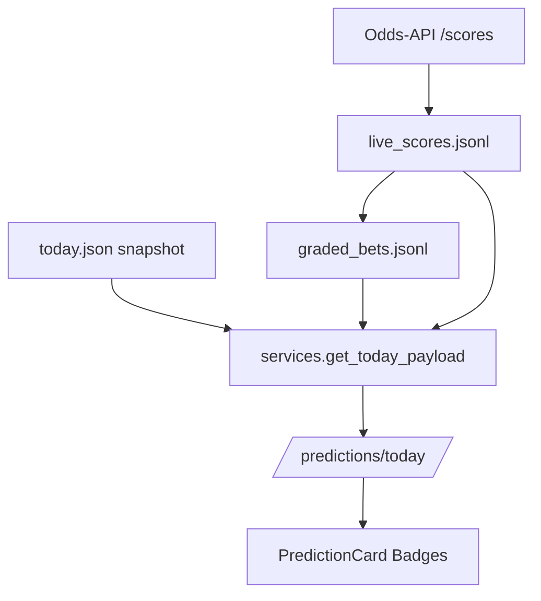

# Plan: "Live" & "Tipp richtig" Badges für Heutige Prognosen

## Ziel

In der Sektion **"Heutige Prognosen — Wahrscheinlichkeiten für Heim · Unentschieden · Auswärts"** (gerendert durch [`./web/components/PredictionCard.tsx`](./web/components/PredictionCard.tsx)) sollen pro Spiel zwei neue Status-Badges angezeigt werden:

1. **`LIVE`** — wenn das Spiel gerade läuft (angepfiffen, noch nicht beendet).
2. **`TIPP RICHTIG`** / **`TIPP FALSCH`** — wenn das Spiel abgeschlossen ist und die Modell-Vorhersage (`most_likely`) mit dem tatsächlichen Ergebnis (`ft_result`) verglichen werden konnte.

Die Badges werden aus den bereits existierenden Daten-Pipelines (Odds-API `/scores` + `graded_bets.jsonl`) abgeleitet — es muss nichts neu gescraped werden.

## Architektur-Überblick



## Datenflüsse (bereits vorhanden)

- [`./src/football_betting/evaluation/live_results.py:152`](./src/football_betting/evaluation/live_results.py:152) `poll_and_store_scores` schreibt **nur** `completed`-Matches in `live_scores.jsonl` (siehe `_score_to_row` L133 — returned `None` falls nicht completed).
- [`./src/football_betting/evaluation/grader.py:122`](./src/football_betting/evaluation/grader.py:122) `_grade_one` vergibt `status ∈ {"won","lost","pending"}` und `ft_result`.
- [`./src/football_betting/api/services.py:384`](./src/football_betting/api/services.py:384) `get_today_payload` lädt den Snapshot und liefert `PredictionOut` aus — ohne Live/Graded-Anreicherung.
- `ScoreResult` der Odds-API ([`./src/football_betting/scraping/odds_api.py:36`](./src/football_betting/scraping/odds_api.py:36)) kennt bereits `completed: bool`, `home_goals`, `away_goals`, `kickoff_utc` — alles was wir brauchen um "live" zu erkennen (`completed=False` **und** `kickoff_utc <= now`).

## Umsetzung

### 1. Backend — Live-Status persistieren

**`./src/football_betting/evaluation/live_results.py`**

- `LiveScoreRow` um zwei optionale Felder erweitern:
  - `status: str` — `"live" | "completed"` (Default `"completed"` für Abwärtskompatibilität mit bestehenden Rows).
  - `kickoff_utc: str | None` — ISO-UTC, aus `ScoreResult.kickoff_utc`.
- `_score_to_row` aufteilen bzw. erweitern: auch `completed=False`-Matches akzeptieren, wenn `kickoff_utc <= now_utc` (⇒ `status="live"`). Bei `completed=True` wie bisher (`status="completed"`).
- `poll_and_store_scores` merge-Logik anpassen: `live` darf von `completed` überschrieben werden (nie umgekehrt). `(prev.status, row.status)`-Matrix:
  - `completed` + eintreffender `live` ⇒ keep `completed`.
  - `live` + eintreffender `completed` ⇒ upgrade.
  - `live` + `live` ⇒ Score-Update (neue Goals).
- Neue Helper: `load_live_matches_for_code(code) -> dict[(date, home_norm, away_norm), tuple[status, hg, ag]]`.
- `_load_results_for_league` ([`./src/football_betting/evaluation/grader.py:62`](./src/football_betting/evaluation/grader.py:62)) darf wie bisher **nur completed** einbeziehen — Grading bleibt unverändert, Live-Matches werden nicht vorzeitig als pending→won/lost gewertet.

### 2. Backend — Schemas

**`./src/football_betting/api/schemas.py`** — `PredictionOut` um drei optionale Felder ergänzen:

```python
is_live: bool = False
pick_correct: bool | None = None  # None = pending, True/False = settled
ft_score: str | None = None       # "2-1" wenn live oder completed
```

Rückwärts-kompatibel, weil alle drei Felder Defaults haben (alte Snapshots laden ohne Migration).

### 3. Backend — Anreicherung in `get_today_payload`

**`./src/football_betting/api/services.py:384`** `get_today_payload`:

Nachdem `snapshot` geladen wurde und **vor** dem League-Filter die Predictions anreichern:

```python
snapshot = _enrich_predictions_with_live_and_graded(snapshot)
```

Neue Funktion `_enrich_predictions_with_live_and_graded(payload) -> TodayPayload`:

- Lädt `graded_bets.jsonl` einmalig via `load_graded()`.
- Lädt pro League-Code `load_live_matches_for_code(code)`.
- Join-Key: `(date, norm(home), norm(away))` — `_norm` bereits aus `grader.py` verfügbar.
- Für jede Prediction:
  - **graded match** gefunden mit `status ∈ {won, lost}` ⇒ `pick_correct = (g.outcome == pred.most_likely) if g.ft_result else None`, `ft_score = g.ft_score`, `is_live=False`.
    - Wichtig: `GradedBet.outcome` = getippter Ausgang; `pick_correct = (g.ft_result == pred.most_likely)`.
  - **live match** gefunden ⇒ `is_live=True`, `ft_score=f"{hg}-{ag}"`.
  - sonst ⇒ Defaults (pending/upcoming).
- Cache-Verhalten: `get_today_payload` hat keinen eigenen Cache, wird bei jedem Call neu gerufen (Snapshot-File selbst ist der Cache). Kein TTL-Problem.

### 4. Backend — Scheduler

Prüfen ob der `./src/football_betting/api/scheduler.py` bereits `poll_and_store_scores` aufruft — falls ja, einfach mitziehen (liefert nun auch Live-Zeilen). Falls Polling z.B. nur alle 5 Min läuft: Kadenz für Live-Phase enger (z.B. alle 60-120 s) — **nur wenn nötig**, sonst Scope-Creep. Im Zweifel: aktueller Rhythmus reicht für MVP-Badge.

### 5. Frontend — Types & API

**`./web/lib/types.ts`** — `Prediction`-Interface erweitern:

```ts
is_live?: boolean;
pick_correct?: boolean | null;
ft_score?: string | null;
```

### 6. Frontend — UI Badges in `PredictionCard`

**`./web/components/PredictionCard.tsx`** — im Header neben `league_name` / Datum zwei konditionale Badges:

```tsx
{prediction.is_live && (
  <span className="pill pill-live">
    <span className="live-dot" /> {t('predictionCard.badge.live')}
    {prediction.ft_score && ` · ${prediction.ft_score}`}
  </span>
)}
{prediction.pick_correct === true && (
  <span className="pill pill-positive">
    {t('predictionCard.badge.correct')}
  </span>
)}
{prediction.pick_correct === false && (
  <span className="pill pill-negative">
    {t('predictionCard.badge.incorrect')}
  </span>
)}
```

Ein Spiel ist entweder live **oder** bereits gegraded — nie beides. Pending-Spiele (Zukunft, noch nicht angepfiffen) zeigen keinen Badge.

### 7. Frontend — Styling

**`./web/app/globals.css`** — erweitern:

- `.pill-live` — rot/akzentuiert, mit pulsierendem Dot (`@keyframes live-pulse`).
- `.pill-negative` — gedämpftes Grau/Rot für falsche Tipps (Palette-konsistent mit bestehenden `pill-positive`/`pill-accent`).

### 8. Frontend — i18n

Neue Keys in allen 5 Locale-Files (`./web/lib/i18n/{de,en,es,fr,it}.ts`):

- `predictionCard.badge.live` — DE: `"Live"`, EN: `"Live"`.
- `predictionCard.badge.correct` — DE: `"Tipp richtig"`, EN: `"Pick correct"`.
- `predictionCard.badge.incorrect` — DE: `"Tipp falsch"`, EN: `"Pick incorrect"`.

Zuerst in `./web/lib/i18n/en.ts` (Dictionary-Master definiert Typ), dann in de/es/fr/it.

## Kritische Dateien

| Datei | Änderung |
|---|---|
| `./src/football_betting/evaluation/live_results.py` | Live-Rows persistieren, `load_live_matches_for_code` |
| `./src/football_betting/api/schemas.py` | `PredictionOut` + 3 Felder |
| `./src/football_betting/api/services.py` | `_enrich_predictions_with_live_and_graded` + Aufruf in `get_today_payload` |
| `./web/lib/types.ts` | `Prediction` + 3 Felder |
| `./web/components/PredictionCard.tsx` | Badges im Header |
| `./web/app/globals.css` | `.pill-live`, `.pill-negative` |
| `./web/lib/i18n/{en,de,es,fr,it}.ts` | 3 neue i18n-Keys |

## Tests

- **`./tests/test_live_results.py`** — neuen Case: `poll_and_store_scores` persistiert In-Progress-Match als `status="live"`, `completed=True`-Update überschreibt zu `status="completed"`.
- **`./tests/test_api.py`** — Snapshot mit einem vergangenen (graded) und einem gerade laufenden (live) Match; assert `PredictionOut.is_live` und `pick_correct` sind korrekt gesetzt nach `get_today_payload`.
- **Frontend** — `npm run type-check && npm run lint` in `web/`.

## Verifikation End-to-End

1. `pytest tests/test_live_results.py tests/test_api.py -v` — grün.
2. `ruff check . && mypy src` — keine neuen Fehler.
3. In `web/`: `npm run type-check && npm run lint && npm run build`.
4. Manuell (optional, mit Key): `SCRAPING_ENABLED=1 fb snapshot` dann `fb serve` und Homepage öffnen — bei laufendem Spiel blinkt der Live-Dot, für abgeschlossene Matches erscheint `Tipp richtig`/`Tipp falsch`.

## Out of Scope

- Minute/Spielzeit im Live-Badge (Odds-API liefert kein Minutenfeld zuverlässig).
- Push/WebSocket-Updates — Next.js `react-query` pollt bereits (falls konfiguriert) bzw. Nutzer-Refresh reicht für MVP.
- Value-Bet-Badges in derselben Sektion — betreffen eigene Card-Komponente (`ValueBetBadge.tsx`), bei Bedarf in Folge-Task.
